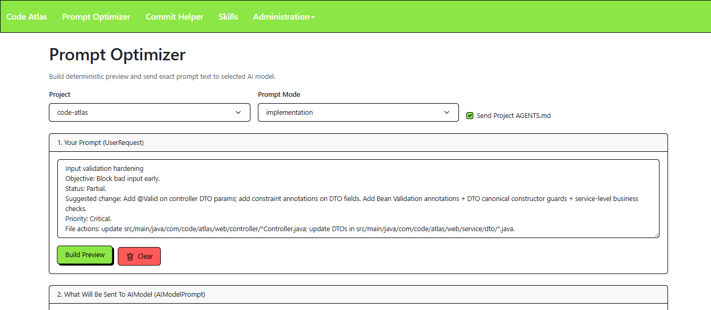
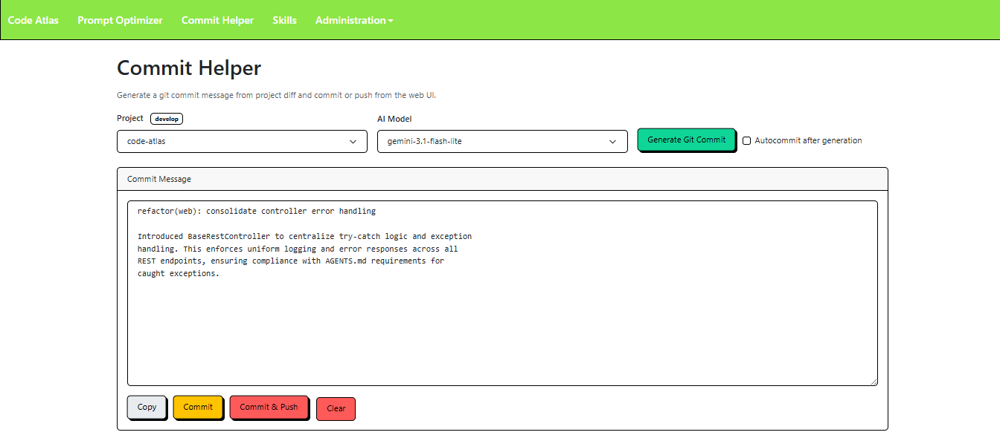
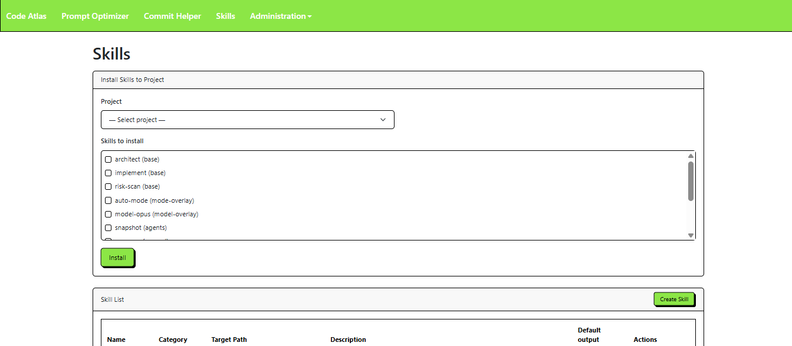

# Code Atlas

[](https://github.com/gncabrera/code-atlas/actions/workflows/ci.yml)


Web app that turns raw implementation requests into structured, implementation-ready prompts, then sends them to frontier coding models with predictable, auditable behavior.

## Table of Contents

- [Screenshots](#screenshots)
- [Features](#features)
- [Quick Start](#quick-start)
- [Configuration](#configuration)
- [Pages and Capabilities](#pages-and-capabilities)
- [REST API](#rest-api)
- [Prompt Templates](#prompt-templates)
- [Architecture](#architecture)
- [Database](#database)
- [Security](#security)
- [Troubleshooting](#troubleshooting)
- [Development](#development)
- [Contributing](#contributing)
- [License](#license)

## Screenshots







## Features

- **Deterministic prompt preview** — template concatenation only; no hidden AI rewrite on build.
- **Exact model send** — `sendToModel` uses the prompt textarea as-is.
- **Project-aware context** — indexed file retrieval and optional `AGENTS.md` injection.
- **Token guard** — estimated tokens (`characters / 4`) compared to model `tokensPerMinute`.
- **CRUD** — projects, AI models, API keys, skills.
- **Commit Helper** — git diff → AI commit message → commit / push.
- **Skills install** — write skill prompt files into a project tree.
- **Prompt history** — SQLite audit of requests and responses.
- **Hybrid UI** — Thymeleaf pages + JSON REST under `/api/*`.

## Quick Start

### Requirements

- JDK 21
- Maven 3.9+

### Run from source

```bash
mvn -DskipTests spring-boot:run
```

Open [http://localhost:8088/prompt-optimizer](http://localhost:8088/prompt-optimizer) (default port in `application.properties`).

### First-time setup

1. **API Keys** (`/api-keys`) — create a Gemini key record; replace the seeded `changeme` value from migration `V1`.
2. **AI Models** (`/ai-models`) — enable models and link each to an API key.
3. **Projects** (`/projects`) — register local repo paths (must exist on disk).

Prebuilt platform zips (when published) attach to [GitHub Releases](https://github.com/gncabrera/code-atlas/releases). Release automation lives in `.github/workflows/release.yml`.

## Configuration

File: `src/main/resources/application.properties`

| Property | Default | Purpose |
|----------|---------|---------|
| `server.port` | `8088` | HTTP port |
| `atlas.data.dir` | `data` | SQLite and logs directory |
| `spring.datasource.url` | `jdbc:sqlite:${atlas.data.dir}/app.db` | Application database |
| `codeatlas.gemini.timeout-seconds` | `90` | Gemini HTTP timeout |

Override at runtime:

```bash
mvn -DskipTests spring-boot:run -Dspring-boot.run.arguments="--atlas.data.dir=./my-data"
```

Distribution bundles use `data/` next to the launcher scripts (`src/main/resources/scripts/run.sh`, `run.bat`).

## Pages and Capabilities

| Route | Purpose |
|-------|---------|
| `/`, `/prompt-optimizer` | Build preview, edit prompt, send to model |
| `/commit-helper` | Generate commit message from git diff; commit or push |
| `/skills` | Manage skills; install into project paths |
| `/projects` | Project CRUD and `useAgentsFile` flag |
| `/ai-models` | Model CRUD, rate limits, API key link |
| `/api-keys` | Provider API key CRUD |
| `/admin/prompt-history` | Read-only prompt audit list |

### Prompt Optimizer

- Select **project**, **prompt mode**, and whether to include **AGENTS.md**.
- **Build Preview** loads `src/main/resources/prompts/<mode>.md` and substitutes `{{ USER_REQUEST }}`, `{{ CONTEXT }}`, `{{ AGENTS_FILE }}`.
- **CONTEXT** comes from `PromptContextService` (project file index + query parsing).
- **Send To AIModel** posts the exact preview text; blocked when estimated tokens exceed the model limit.

Prompt modes: `cheap`, `balanced`, `architect`, `implementation`, `reviewer`, `refactor`, `security` (default when unset: `balanced`).

### Projects

- Fields: `path`, `name`, `description`, `useAgentsFile`.
- Path must exist; when `useAgentsFile` is true and preview requests agents file, backend reads `<path>/AGENTS.md` or a fallback message.

### AI Models and API Keys

- Models reference `ai_model_api_key` via `apiKeyId` (no inline key on the model row).
- Enforced limit: `tokensPerMinute` on send. `requestsPerMinute` / `requestsPerDay` are informational.
- Providers are stored on API key records (Gemini used for model calls today).

### Skills

- Catalog entries: name, prompt body, `targetPath` (relative to project root), optional description/category, `defaultInOutputPrompt`.
- **Install** (`POST /api/skills/install`) writes files under the selected project with path-traversal checks.

### Commit Helper

- Requires a git repository at the project path.
- **Generate** builds a prompt from `prompts/commit-message.md` and working-tree diff (truncated to model token budget).
- **Commit** / **Commit and push** run `git` via `GitProcessRunner`.

### Prompt History

- Records project, model, notes, estimated tokens, request/response text, status (`PENDING`, `SUCCESS`, `ERROR`), timestamps.
- Admin UI is read-only; API list at `/api/prompt-history`.

## REST API

All JSON endpoints return `ApiResponse` (`result`, `message`, `data`).

| Area | Base path | Notes |
|------|-----------|--------|
| Prompts | `/api/prompts` | `GET /metadata`, `POST /build-preview`, `POST /send` |
| Projects | `/api/projects` | CRUD |
| AI models | `/api/ai-models` | CRUD; `GET ?enabledOnly=true` |
| API keys | `/api/api-keys` | CRUD |
| Skills | `/api/skills` | CRUD + `POST /install` |
| Commit helper | `/api/commit-helper` | `GET /metadata`, `POST /generate`, `POST /commit`, `POST /push` |
| Prompt history | `/api/prompt-history` | `GET` list |

## Prompt Templates

Classpath templates: `src/main/resources/prompts/`

| Mode | File |
|------|------|
| cheap | `cheap.md` |
| balanced | `balanced.md` |
| architect | `architect.md` |
| implementation | `implementation.md` |
| reviewer | `reviewer.md` |
| refactor | `refactor.md` |
| security | `security.md` |
| commit helper | `commit-message.md` |

Edit templates and restart the app to pick up changes.

## Architecture

```
Browser (Thymeleaf + jQuery)
  → Page controllers (views)
  → REST controllers (/api/*)
    → Services
      → Repositories (JPA)
        → SQLite (Flyway)
```

Entrypoint: `com.code.atlas.web.CodeAtlas` (`CodeAtlas.java`).

**Coding standards, package layout, REST error handling, SQLite timestamp rules, and frontend conventions** are defined in [AGENTS.md](AGENTS.md). Do not duplicate those rules here.

## Database

Flyway migrations: `src/main/resources/db/migration/`

| Migration | Content |
|-----------|---------|
| `V1__init_schema.sql` | `projects`, `ai_model_api_key`, `ai_models`, `prompt_history`, `skill`, `project_file_index` + seed data |
| `V2__seed_skills.sql` | Default skill rows |

Schema authority is Flyway (`spring.jpa.hibernate.ddl-auto=none`).

## Security

- No authentication in the default deployment — treat as **internal tooling**.
- API keys are stored in SQLite as plaintext by design for this MVP.
- Do not expose on public networks without auth, TLS, and a secrets strategy.
- Commit Helper executes `git` against configured project paths — only register trusted directories.

## Troubleshooting

### `KotlinModule not found`

Jackson may auto-load the Kotlin module. Dependency `jackson-module-kotlin` is already on the classpath via `pom.xml`.

### JPA / SQLite type validation errors

Use Flyway for schema; keep `spring.jpa.hibernate.ddl-auto=none`.

### `Error parsing time stamp` on SQLite reads

Entity timestamps must use `LocalDateTime` per [AGENTS.md](AGENTS.md) (never `Instant` on SQLite entities).

### Port already in use

Change `server.port` or stop the process bound to `8088`.

## Development

```bash
mvn test
mvn -DskipTests spring-boot:run
```

See [AGENTS.md](AGENTS.md) before changing controllers, services, migrations, or static assets.

## Contributing

1. Fork and branch from `main` or `develop`.
2. Keep changes aligned with [AGENTS.md](AGENTS.md).
3. Run `mvn test` and ensure CI passes.
4. Open a pull request with a short description and test notes.

## License

[MIT](LICENSE)
