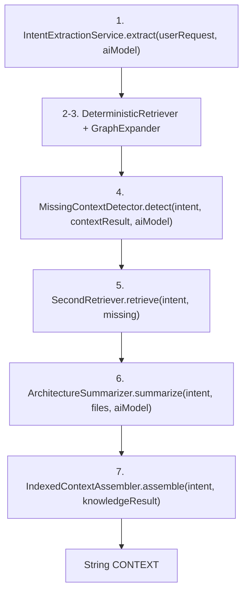

# ARCHITECTURE.md

# Prompt Optimizer

## Invariants

* El sistema debe ser language-agnostic.
* Toda recuperación de contexto debe ser index-driven.
* Los motores de recuperación no deben parsear código fuente directamente.
* Los LLMs no participan en búsquedas primarias.
* Los LLMs solo participan en:

    * Intent Extraction
    * Missing Context Detection
    * Architecture Summary
    * Final Implementation
* La indexación debe ser incremental mediante hash.
* Cada índice debe persistirse en tablas independientes.
* Graph Expansion debe utilizar exclusivamente Dependency Graph.
* Prompt Builder debe ser completamente determinístico.
* Debe ser posible habilitar/deshabilitar lenguajes por proyecto.

---

## Architectural Boundaries

### Intent Engine

Responsable únicamente de:

* Intent Extraction

Produce:

* Intent

No realiza búsquedas.

---

### Context Engine

Responsable únicamente de:

* Deterministic Retrieval
* Graph Expansion
* Second Retrieval

Produce:

* ContextResult

No realiza llamadas a LLM.

---

### Knowledge Engine

Responsable únicamente de:

* Missing Context Detector
* Architecture Summary

Produce:

* KnowledgeResult

No realiza indexación.

---

### Prompt Engine

Responsable únicamente de:

* Prompt Builder
* Envío a modelo final

Produce:

* AIModelPrompt

No realiza retrieval.

---

### Indexing Subsystem

Responsable únicamente de:

* Descubrimiento de archivos
* Detección de lenguaje
* Ejecución de indexers
* Persistencia de índices

No participa en generación de contexto.

---

## Required Indices

### FILE_INDEX

Inventario de archivos.

---

### SYMBOL_INDEX

Clases
Interfaces
Records
Enums
Métodos

---

### ENDPOINT_INDEX

Endpoints backend.

---

### GRAPH_EDGE

Dependency Graph.

Relaciones:

* CALLS
* USES
* EXTENDS
* IMPLEMENTS
* MAPS_TO
* CONSUMES
* QUERIES
* EXPOSES

---

### DATABASE_INDEX

Tabla
Entity
Repository
Migration

---

### FRONTEND_INDEX

Frontend callers.

---

### BUSINESS_CONCEPT_INDEX

Conceptos de negocio.

Generación offline.

---

### PATTERN_INDEX

Patrones arquitectónicos.

Generación offline.

---

### FILE_SUMMARY_INDEX

Resumen IA por archivo.

Generación offline.

---

## Parser Architecture

La plataforma debe implementar un SPI.

Cada lenguaje provee:

* Detección de archivos
* Extracción de símbolos
* Extracción de relaciones
* Extracción de endpoints
* Extracción de metadata

Ejemplos:

* JavaIndexer
* TypeScriptIndexer
* AngularIndexer
* PythonIndexer

No debe existir lógica específica de lenguaje fuera de los indexers.

---

## Persistence Constraints

* Java 21
* SQLite
* Flyway
* Una tabla por índice
* Sin Neo4j
* Sin Elasticsearch obligatorio
* Sin vector database obligatoria

---

## Current Assumptions

* Repositorio único por proyecto.
* Escala objetivo inicial: 100k–1M LOC.
* Java y Angular son los principales lenguajes soportados.
* Gemma puede ejecutarse localmente para tareas offline.
* Gemini será utilizado para generación final.

---

## Migration Requirements

La arquitectura debe permitir agregar:

* Nuevos lenguajes
* Nuevos índices
* Nuevos tipos de relaciones del grafo

sin modificar motores existentes.

---

# Indexed Context Generation

Concretización implementable del pipeline anterior. Paquete raíz: `com.code.atlas.web.service.context.indexed`.

Mapea `docs/context/ARCHITECTURE.md` (7 steps / 4 engines / 8 indices) a clases, tablas y contratos concretos.

## Decisiones fijadas

* Alcance: pipeline completo (4 Engines + pasos LLM reales).
* Persistencia: una tabla nueva por índice (Flyway).
* LLM: llamadas reales vía `AIModelService.sendToModel`. El `AIModel` lo selecciona el front y se pasa ya resuelto.
* Indexers: solo `JavaIndexer` en esta iteración; SPI abierto.
* Índices offline (Gemma): esquema + pipeline de generación completos.

## Invariantes adicionales

* `buildIndexedContext` no resuelve el `AIModel`: lo recibe ya resuelto (entidad).
* Todo paso LLM (Intent, Missing, Summary) usa `AIModelService.sendToModel` y parsea con `JsonResponseExtractor.parseResponse`.
* Toda sustitución de plantillas LLM usa `PromptFormatService.formatPrompt` (sin `String.replace` de `{{KEY}}`).
* Solo los indexers parsean código fuente; los engines consumen índices.
* `IndexedContextService` (orquestador) es el único que conoce el orden de los 7 steps; los engines no se llaman entre sí (sin dependencias circulares).
* `buildIndexedContext` devuelve solo el bloque CONTEXT (Architecture Facts + Dependency Graph + Relevant Files + Code Snippets). Agents/Design/Instructions y la llamada final a Gemini siguen en `PromptService` vía `{{CONTEXT}}`.
* Indexación incremental por `content_hash` reutilizando `project_file_index`; al cambiar/eliminar un archivo se borran sus filas dependientes en todos los índices.

## Trigger y firma

Entrada actual (stub): [`PromptContextService.buildIndexedContext`](src/main/java/com/code/atlas/web/service/PromptContextService.java) líneas 31-33.

Nueva firma:

```
public String buildIndexedContext(Project project, String userRequest, AIModel aiModel)
```

Delega en `IndexedContextService.build(project, userRequest, aiModel)`.

## Boundaries → clases

Engines como `@Service` dentro de subpaquetes de `...context.indexed` (precedente: `...context.deterministic`).

* `IndexedContextService` (orquestador) — `...context.indexed`
* Intent Engine → `IntentExtractionService` (LLM) — `...context.indexed.intent`
* Context Engine → `DeterministicRetriever`, `GraphExpander`, `SecondRetriever` — `...context.indexed.context`
* Knowledge Engine → `MissingContextDetector` (LLM), `ArchitectureSummarizer` (LLM) — `...context.indexed.knowledge`
* Prompt Engine → `IndexedContextAssembler` (determinístico) — `...context.indexed.prompt`
* Indexing SPI → `LanguageIndexer`, `JavaIndexer`, `IndexBuildService` — `...context.indexed.indexer`
* Offline → `BusinessConceptIndexer`, `PatternIndexer`, `FileSummaryIndexer`, `OfflineIndexService` (LLM) — `...context.indexed.offline`

## Contratos entre engines (records internos del paquete)

* `Intent(String action, List<String> entities, List<String> operations, List<String> layers, boolean frontendImpact)`
* `RetrievedFile(String relativePath, String language, String type, int score, List<String> reasons, List<String> symbols, String snippet)`
* `GraphEdgeView(String source, String target, String relation)`
* `ContextResult(List<RetrievedFile> files, List<GraphEdgeView> graph)`
* `MissingContext(List<String> missing)`
* `KnowledgeResult(String architectureFacts, List<RetrievedFile> files, List<GraphEdgeView> graph)`

## Flujo (orden de los 7 steps en `IndexedContextService`)



* Step 1 (LLM): request → `Intent` (plantilla `prompts/context/intent-extraction.md`, JSON).
* Steps 2-3 (código): `SYMBOL_INDEX` + `BUSINESS_CONCEPT_INDEX` + `ENDPOINT_INDEX` para candidatos; `GRAPH_EDGE` para expandir; `FRONTEND_INDEX` y `DATABASE_INDEX` como saltos.
* Step 4 (LLM): `Intent` + archivos recuperados → `MissingContext` (plantilla `prompts/context/missing-context.md`, JSON; `PATTERN_INDEX` como soporte).
* Step 5 (código): `DATABASE_INDEX` + `FRONTEND_INDEX` + `SYMBOL_INDEX` + `GRAPH_EDGE` para resolver faltantes.
* Step 6 (LLM): archivos + `FILE_SUMMARY_INDEX` → `architectureFacts` (plantilla `prompts/context/architecture-summary.md`).
* Step 7 (código): markdown determinístico.

## Persistencia (Flyway `V6__create_context_indices.sql`)

`FILE_INDEX` reutiliza `project_file_index` existente. Tablas nuevas (todas con `project_id` FK a `projects`, índice por `project_id`, unique para upsert):

* `symbol_index(id, project_id, symbol, kind, file_path, line)` — uq `(project_id, file_path, symbol, line)`
* `endpoint_index(id, project_id, http_method, path, controller, service, file_path)` — uq `(project_id, http_method, path)`
* `graph_edge(id, project_id, source, target, relation, source_file_path)` — uq `(project_id, source, target, relation)`; `relation` ∈ CALLS, USES, EXTENDS, IMPLEMENTS, MAPS_TO, CONSUMES, QUERIES, EXPOSES
* `database_index(id, project_id, table_name, entity, repository, migration, file_path)` — uq `(project_id, table_name)`
* `frontend_index(id, project_id, component, service, endpoint, file_path)` — uq `(project_id, component, endpoint)`
* `business_concept_index(id, project_id, concept, files, updated_at)` — uq `(project_id, concept)` (offline)
* `pattern_index(id, project_id, pattern, files, updated_at)` — uq `(project_id, pattern)` (offline)
* `file_summary_index(id, project_id, file_path, summary, updated_at)` — uq `(project_id, file_path)` (offline)

`updated_at`: `TEXT NOT NULL DEFAULT CURRENT_TIMESTAMP`, app-managed con `@Convert(SqliteLocalDateTimeConverter)` + `LocalDateTime` (ver reglas SQLite en `AGENTS.md`). Columnas multi-valor (`files`) se persisten CSV.

Entidades en `com.code.atlas.web.domain` (`@Entity @Data`), repositorios en `com.code.atlas.web.repository` (`@Repository extends JpaRepository`), una por tabla.

## Indexing SPI

* `interface LanguageIndexer { boolean supports(String extension); IndexerOutput index(IndexFileInput input); }`
* `IndexFileInput(String relativePath, String extension, String content)`
* `IndexerOutput(List<SymbolRow>, List<EndpointRow>, List<GraphEdgeRow>, List<DatabaseRow>, List<FrontendRow>)`
* `JavaIndexer implements LanguageIndexer` — regex-based, reutiliza patrones de `ContextSymbolExtractor`. Único lugar que parsea fuente.
* `IndexBuildService` — recorre archivos (reusa `ContextFileSupport`), despacha al `LanguageIndexer` que soporta la extensión (inyectados como `List<LanguageIndexer>`), persiste filas. Incremental por `content_hash` de `project_file_index`. Se invoca desde `ProjectIndexService.refreshIndex` (o un hook posterior) cuando el índice está stale.

## Pipeline offline (Gemma)

`OfflineIndexService.regenerate(project, aiModel)` genera `BUSINESS_CONCEPT_INDEX`, `PATTERN_INDEX`, `FILE_SUMMARY_INDEX` vía `AIModelService.sendToModel` + `JsonResponseExtractor.parseResponse`. Fuera del hot path (disparo manual / programado). Plantillas en `prompts/context/offline/`.

## Módulos existentes afectados

* [`PromptContextService`](src/main/java/com/code/atlas/web/service/PromptContextService.java) — implementar `buildIndexedContext` con nueva firma; delegar en `IndexedContextService`. Mantener `buildDeterministicContext` como fallback.
* [`PromptService.buildPreview`](src/main/java/com/code/atlas/web/service/PromptService.java) — seleccionar estrategia (`codeatlas.context.strategy=deterministic|indexed`, default `deterministic`); resolver `AIModel` vía `AIModelService.getModelEntity(aiModelId)` y pasarlo a `buildIndexedContext`.
* [`BuildPreviewRequestDto`](src/main/java/com/code/atlas/web/service/dto/BuildPreviewRequestDto.java) — agregar `Long aiModelId`.
* `PromptController` (preview) + `prompt-optimizer.html` + `prompt-optimizer.js` — enviar `aiModelId` seleccionado en el request de preview.
* `ProjectIndexService.refreshIndex` — invocar `IndexBuildService` tras refrescar `project_file_index`.

## Configuración por proyecto

* `codeatlas.context.strategy` (deterministic|indexed)
* `codeatlas.context.indexed.max-files`, `...max-graph-depth`, `...max-total-chars`
* Reutiliza `codeatlas.context.index-max-age-minutes` para staleness.
